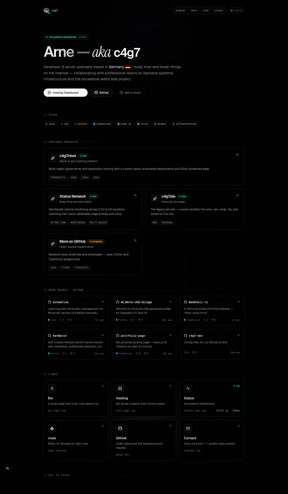

# c4g7 — personal profile site

A dark, minimal Next.js 16 + Tailwind v4 + shadcn-style profile page.



## Features

- Dark-only design with subtle violet/cyan radial glows + grid
- Geist + Geist Mono + Instrument Serif font mix
- Animated hero (shimmer name, staggered fade-in)
- Live `/api/status` endpoint that proxies the Uptime Kuma status page
  (`status.c4g7.com`) and aggregates monitor health
- Status pill in the hero + live status card that refresh every 60s
- Project showcase, link grid with cursor spotlight, stack chips
- Fully static pages (status route is ISR with 60s revalidation)

## Develop

```bash
npm install
npm run dev      # http://localhost:3000
npm run build
npm start
```

## Configuration

Copy `.env.example` to `.env.local` and adjust:

```
NEXT_PUBLIC_STATUS_BASE=https://status.c4g7.com
STATUS_SLUG=default
```

If the slug isn't `default`, find yours in the Uptime Kuma admin → Status Pages.

## Project layout

```
src/
  app/
    api/status/route.ts    # Uptime Kuma proxy & aggregator
    layout.tsx, page.tsx, globals.css
  components/
    hero.tsx, projects.tsx, links-grid.tsx,
    stack.tsx, site-nav.tsx, site-footer.tsx,
    status-indicator.tsx
    ui/                    # shadcn-style primitives
    icons/github.tsx
  lib/
    data.ts                # links + projects data
    utils.ts               # cn()
```

Edit `src/lib/data.ts` to update links, projects, and stack chips.
